# WinchRack-Box V1.1 (WRB)

## About

Multi filament printers such as ERCF & MMU require some way to store the filament that is retracted during a filament swap.
Various 'buffer' implementations exist for this purpose, however they occupy much space, and make loading / unloading filament more difficult.

The AMS implementation is much neater, rewinding the filament automatically back onto the spool.

This box design allows the spool to be neatly stored, with no need for 'buffers' when used in filament swappers.

The rewind mechanism inside the box is based on this original design by 'Mr Goodman' [LINK TO ORIGINAL WINCHRACK](https://github.com/pure100kim/WinchRack_Type2/tree/main). Although I did made a number of small changes to this design (see [MY CHANGES](https://www.printables.com/model/840978-winchrack_type2-filament-rewinder-for-ercf) ) which I would recommend for the WRB.

The mechanism now has both rollers motor driven to improve the functioning with light (near empty) filament rolls.

The BOM below however is a full component list for the box and mechanism.

Total cost of building a WRB excluding plastics should be less than $17US (plus any shipping costs).

## BOM 

Wago 5pin x 2

- Opto endstop x 1 (https://www.aliexpress.com/item/1005005304758202.html)
- n20 gear motor 300 rpm 5v ~ 6v x 1 (https://www.aliexpress.com/item/32910935772.html)
- Solenoid 5v/3kg x 2 (https://www.aliexpress.com/item/32575060483.html)
- mosfet switch 1ch x 1 (https://www.aliexpress.com/item/1005006165294338.html)
- 608zz Bearings x 4 (https://www.aliexpress.com/item/1005005321486587.html)
- 623zz Bearings x 8 (https://www.aliexpress.com/item/1005005480256021.html)
- silicon ring x 1 (https://www.aliexpress.com/item/1005005445878990.html)
- PTFE tube 3x4 or 2x4 (https://www.aliexpress.com/item/1005001408141263.html)
- m3 insert nut (OD 5mm, L 4mm)
- m3 bolts (get a selection pack if you've not already got one)
- m2 self tapping screw 8~10mm x 4
- 6mm collet for 4mm PTFE Tube x 1 (https://www.aliexpress.com/item/4001119588533.html)
- D2F Micro switch (https://www.aliexpress.com/item/1005004693669754.html)
- 4mm Bearing ball (https://www.aliexpress.com/item/1005003377385833.html) (Or these can be taken from inside a 608zz bearing)
- 12V 3A DC Power Connector (https://www.aliexpress.com/item/1005005610836339.html)
- Assorted wego style connectors (https://www.aliexpress.com/item/1005007090402568.html)
- 5V power supply (plugged for your country)

## PRINTING

I've printed all parts in both PLA and PETG and haven't had any problems with either.

### Size

The largest component is the base box, which requires a bedsize of 256x256. I printed on an X1C and a Voron2.4.

### Supports

- The bufferbase_mount (support under the solenoid mount). 

- The box-top as indicated below:

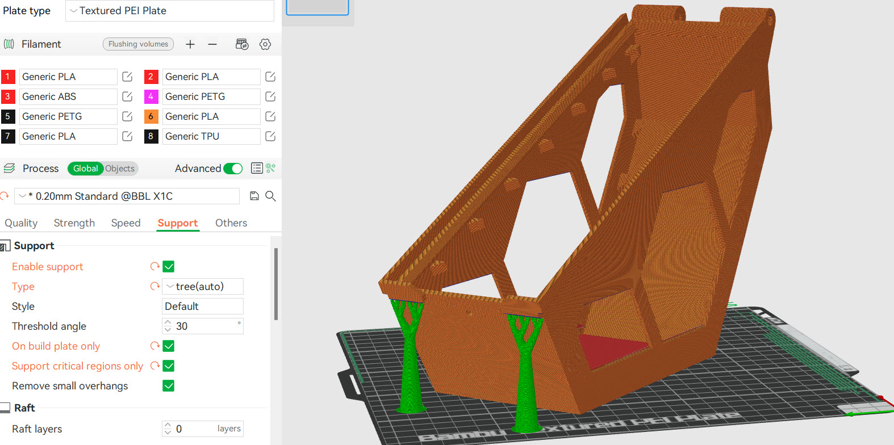

### Sensor key colour

The opticalsensorkey should be printed in a dark colour to avoid light affecting the optical sensor.

### Rollers

I suggest printing the rollers in TPU to increase friction.

### Sizing

If you find the rollers are not fully connecting to the drive wheels when rewinding, you may wish to reprint the rollers slightly scaled in circumference (say 1mm). I found I needed to do this with one brand of TPU due to shrinkage during printing.

### Knob

The knob is provided as an stl with two bodies, which can be split in the slicer to print the text in a different colour. If the text is not required, then don't split the stl.

Alternatively the knob-no-text stl can be printed, this has the text indented into the knob (ie a single colour print with the text indented).

## BUILD GUIDE

Let the fun begin.

A number of part will need heatset inserts, I'll highlight these as we go.

### Prefer 12Volts?

This is currently a 5Volt build. However by replacing the motors with 12Volt ones, every other component will then work on 12V if preferred.

### Use the right base plate

My suggestion is to build the mechanism onto the right base plate, and get the electronics working before fully assembling the box. I've used wego style connectors to simplify much of the connections. These also allow easy changes to motor directions etc if needed. The wego boxes should snap into place as indicated.

### Insert panels

The hexagonal holes in the box frame are filled with the four panels. Alternatively they can be replaced by 3mm thick clear sheeting cut to size (print a panel as a cutting guide). The panel click into place - however you may want to place a bead of CA glue around their edges to strengthen and reduce air flow.

The drive mechanism consists of two separate units, the front and the rear. Both have a drive motor, the rear also has the filament movement sensor.

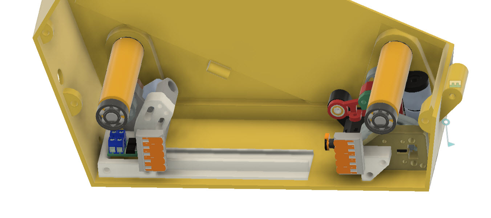

## FRONT ASSEMBLY

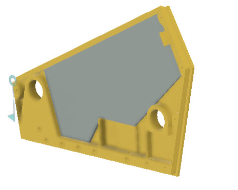

- Insert the 608 bearings into the left and right bodies.
- Clip in two 5-point wego connectors
- Clip in the right panel (you can leave out for later if you prefer, this is removable even when completed.)
- Select all the printed parts for the front-assembly.

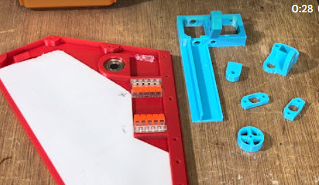

- Insert heatset inserts into the locations indicated below

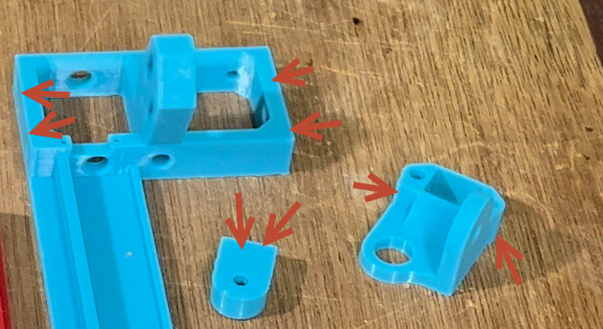

- Put the small rubber band around the drive wheel. I find using a small allen key helps lever the band into place.
- Push a small bearing into the AcceleratorMount.
- Assemble the motor into AcceleratorMount and mount cover, and push on the drive wheel.
  - Note that the rear motormount has a small cut-away area that the front one does not have.
  - The wheel must align to the notch on the motor shaft. The fit can be very tight - fortunately the motors can take a surprising amount of pressure.
- Solder a length of wire to the motor (its not clear which is +ve/-ve so later we will test the direction).
  - I always used longer wire leads than needed to ensure I could cut to length later.

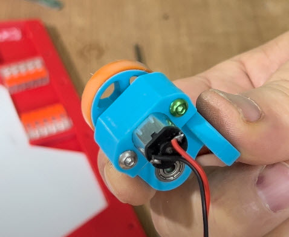

- The accelerator assembly will then pivot on the front-base-accel-pedal-mount using the inserted bearing. Screw an m3 bold through the bearing into the pedal-mount.
  - Note that the assembly should move freely as indicated.

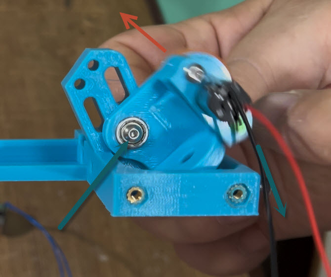

Insert a screw into the rear of the mount as shown below. This screw can be used to restrict how far the assembly drops (we only needs about 2mm gap between the solenoids once fitted).

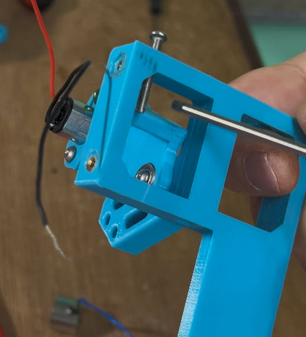

- Attach a solenoid as shown using an m4 bolt (sometimes the bolt is supplied with the solenoid - sometimes its not).
- Route the four wires through the base, using the 2nd hole (the first/middle hole is for ptfe tube for the filament to route through).

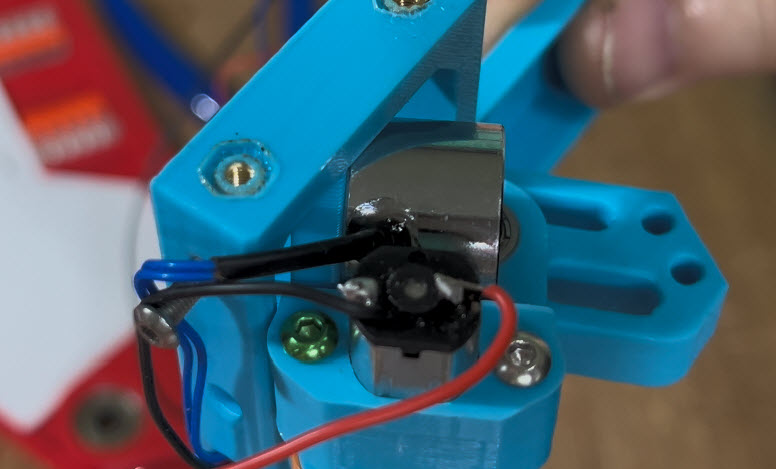

- Attach 2nd solenoid to the AccelPedalMagSol

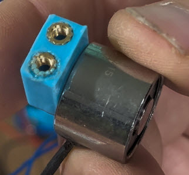

- Use two screws to attach this as shown, routing the wires through the slot.

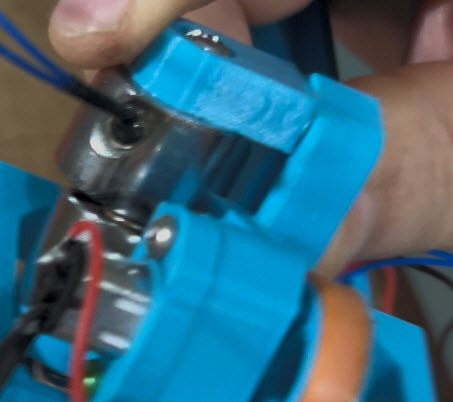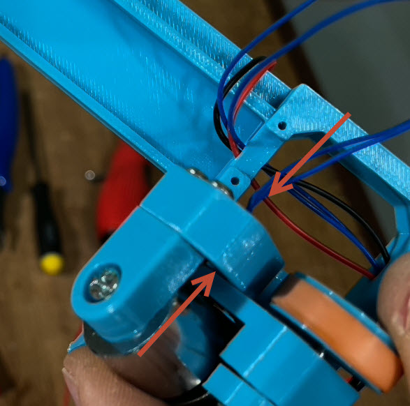

- Adjust the solenoids to be flat to each other
  - The screws holding the solenoids and the AccelPedalMagSol all have a very slight movement. Slacken the screws, physically hold the solenoids together, and re-tighten.
  - At this point we are looking for a movement of about 2mm between the solenoids. When held flat on the table, the solenoids should fall apart 2mm easily. The gap can be reduced using the screw inserted at the rear of the base.
  - If the movement is not very easy, then loosen the bolt holding the pivot bearing.
  - Also ensure that the wire routing is not affecting the movement.

<video width="320" height="240" controls>
  <source src="videos/ss.mov" type="video/mp4">
</video>

[You Tube Copy](https://youtu.be/2NZAOF3inoc)

- Take the mosfet switch and connect a length of wire to one of the trigger connections (it doesn't matter which one).
  - Leave a good length of wire as this will route through to the microswitch on the rear assembly.

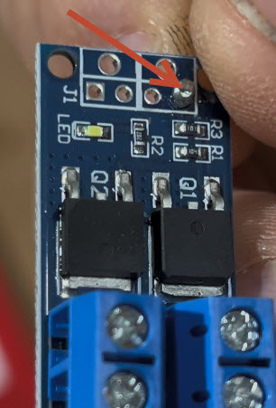

- Screw in four lengths of cable to the mosfet as shown. We do this now because once attached to the base, it becomes difficult to a access. Again leave plenty of length on the cables so we can trim to size later.

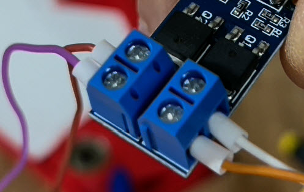

- Attach the mosfet to the base as shown using two m2 self-tapping screws.

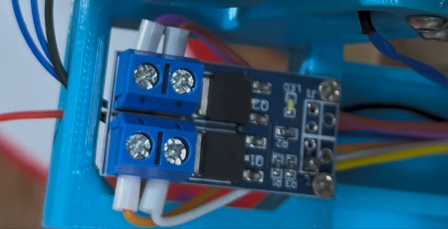 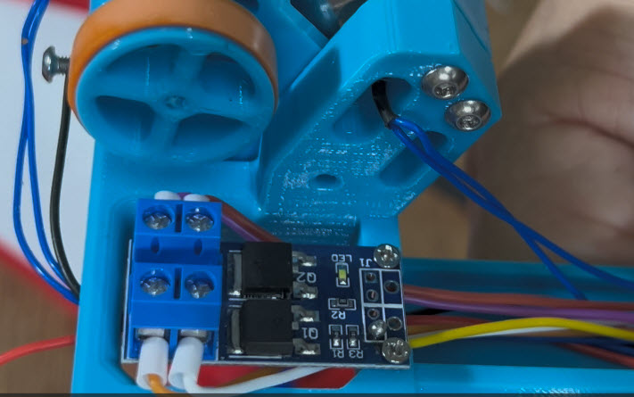

- Attach the assembly to the side panel using two m3 screws.

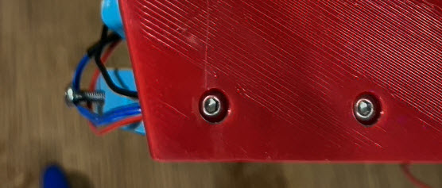

### Wiring the front assembly

<video width="320" height="240" controls>
  <source src="vidoes/fa.mov" type="video/mp4">
</video>

[You Tube Copy](https://youtu.be/1QWAKU8oQXM)

The front assembly has three devices that need to be driven - The motor, and the two solenoids.

We will use the two wego connectors to create a +ve and -ve terminal, use a marker to indicate which is going to be used for which.

#### Motor connection
  - Use a 5 Volt supply to test the direction of the motor. You want the motor to turn so the top moves to the front of the unit. Shorten and insert the +ve/-ve of the motor into the correct wego blocks.

#### Solenoid connection. 
  - Here we need to determine the correct leads to connect together.
  - Twist one lead from each of the solenoids to one from the other solenoid. Do the same with the 2nd lead from each. 
  - Connect 5V to see if the solenoids snap together (move them by hand to check the distance isn't too far.)
  - If they snap together, then we have the correct pairing, if not, then swap over the pairings and retry.
  - Having established which wires go together, plug the twisted wires into the +ve and -ve wego blocks. (Which is +/-ve doesn't matter),

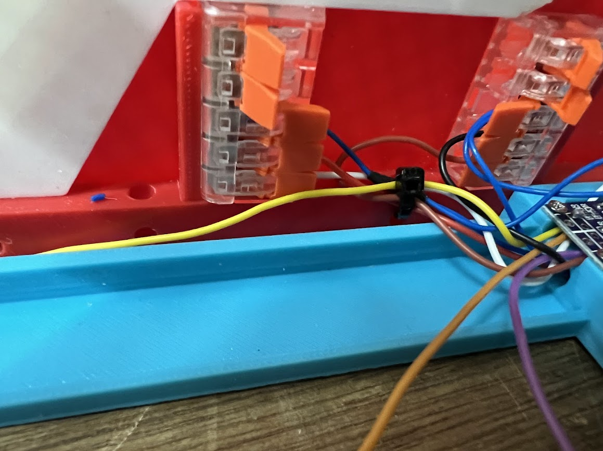

- Power in connector block
  - Add to 3-block wego connectors onto the right of the rail on the base of the front assembly. 
  - These will be the main 5V input power points of the build. (The 5-unit blocks are only energised when the motors are to run).
  - Mark the 3-block wego's with +ve and -ve
  - Run a wire from each block back through the hole in the front assembly (where most of the wires are running) - this will later be connected to the power source using a 12v connector. I'd suggest using red/black wires to indicate +/-ve.

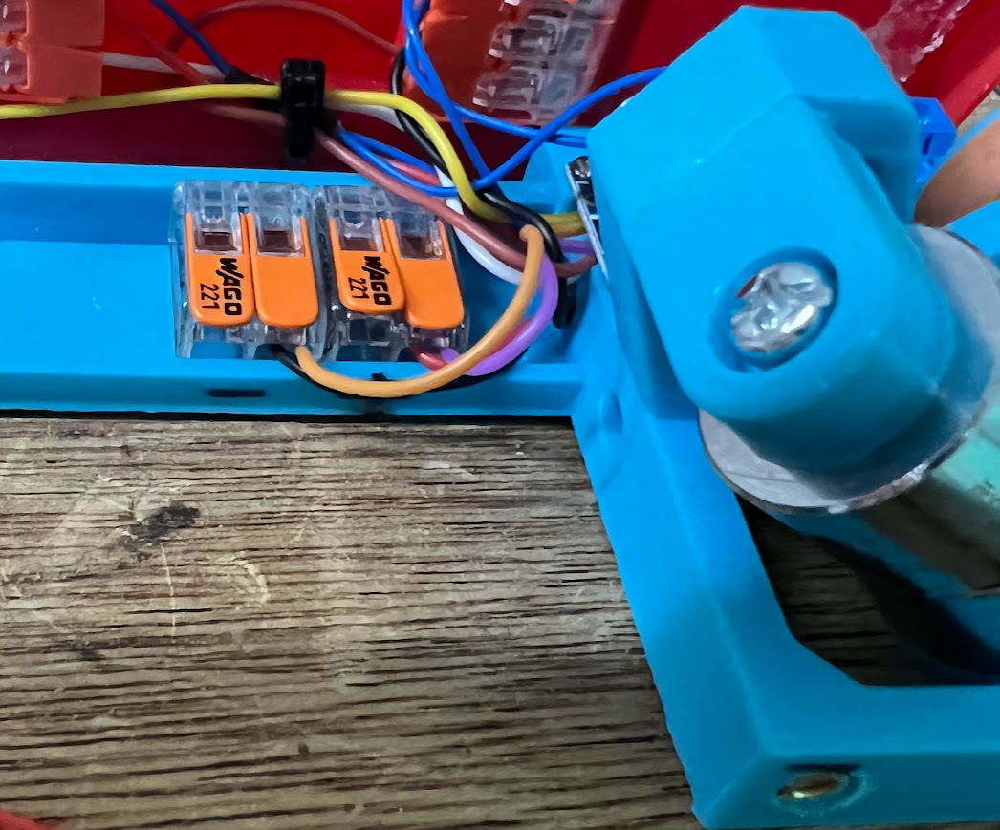 (Note: I've used a 2-connector as this was all I had at hand)
  
- Mosfet connection.
  - Plug the +/-ve IN wires from the mosfet into the +/- 3-block wego connectors (ie the power in wego just added).
  - Plug the +/-ve OUT wires from the mosfet into the +/- 5-block wego connectors (ie to power the motor and the solenoids).
  
At this point the only wire not connected (other than the main 5v power input) is the wire going to the mosfet trigger. This will be connected later.

Note the zip tie connection points down the side to aid tidying the wires.

## REAR Assembly

Gather the parts needed for the rear assembly

- Add heatset inserts as indicated.

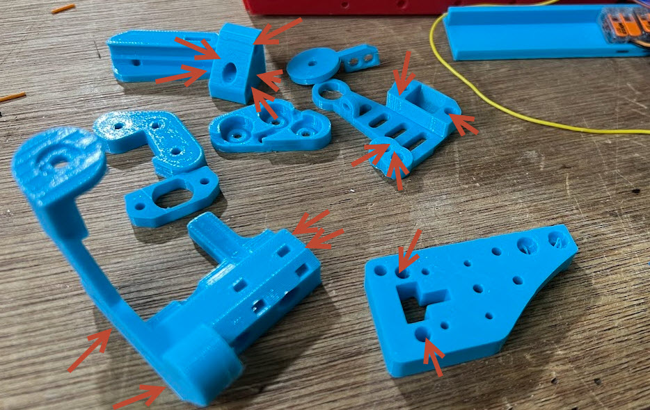

### BufferRail Assembly

- Add four bearings as shown. Connected with m3 screws. Ensure they are tight, but free to move.

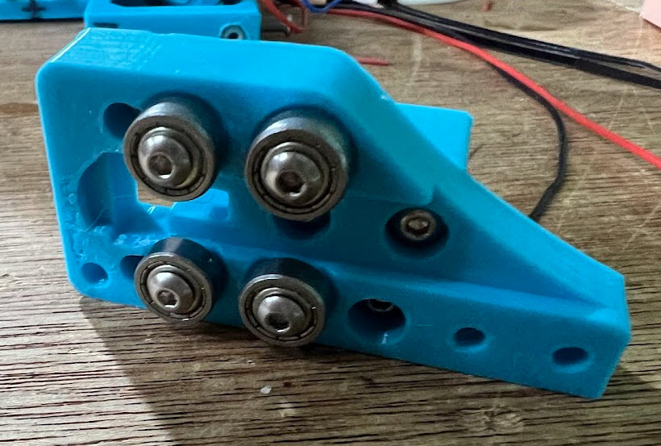

- Attach the SensorDetection_sensor_basemount to the bufferrail. Not that this has a hole for later routing of wires.

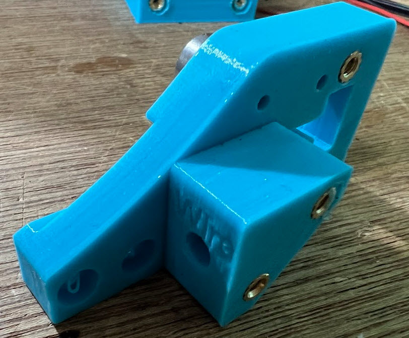

- Push a bearing into the AccelPedalMag
- Attach the BaseSolJoint to the AccelPedalMag
- Screw an M3 screw in as shown. This can be used later to restrict the movement of the pedal.
- Solder two wires to the motor (leave sufficient length to trim later).
- Insert the motor into the pedal as shown.

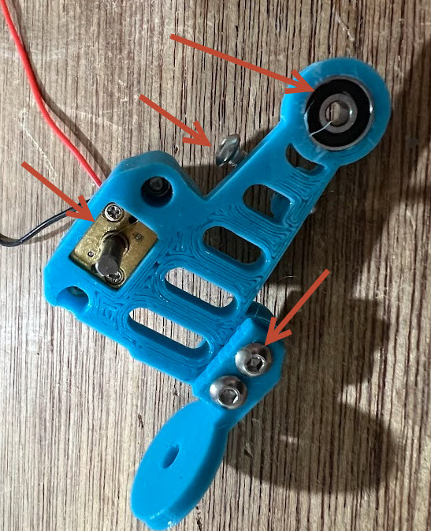

- Attach the motor using the motor-mount. Note that the rear motor-mount has a small cut-away area that the front one does not have.

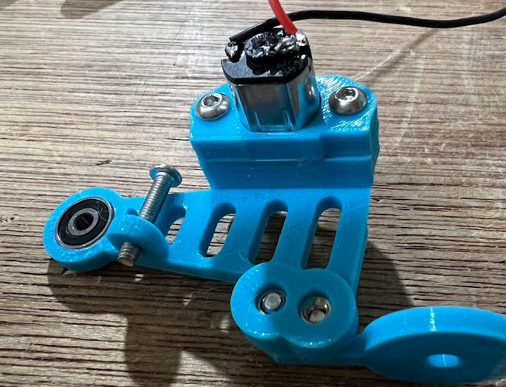

- Again place a band over/around the wheel.
- Attach the wheel to the motor, like the front wheel, this is a tight fit.

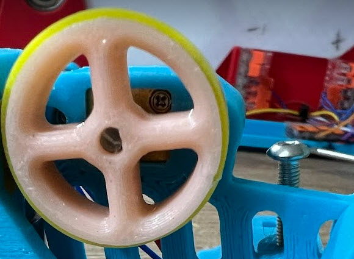

- Attach the AccelPedalMag to the Bufferbase_mount with a single screw through the bearing (as done with the front). You can now see how the screw fitted earlier can be used to limit travel.
    - Ensure the pedal moves freely.
    - Ensure your heatset insert isn't as poorly fitted as the one in this photo :-)

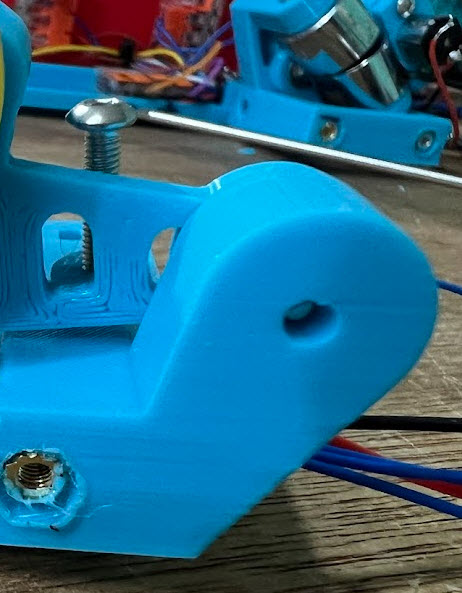

### Solenoids

- Attach the solenoids as show.
    - Again use the slight free-play when the screws are loose to ensure a good closed fit between the two solenoids.
    - You only need a 1 or 2mm gap between the open solenoids.

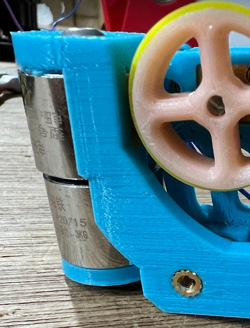

- Route the wires through the hole as shown

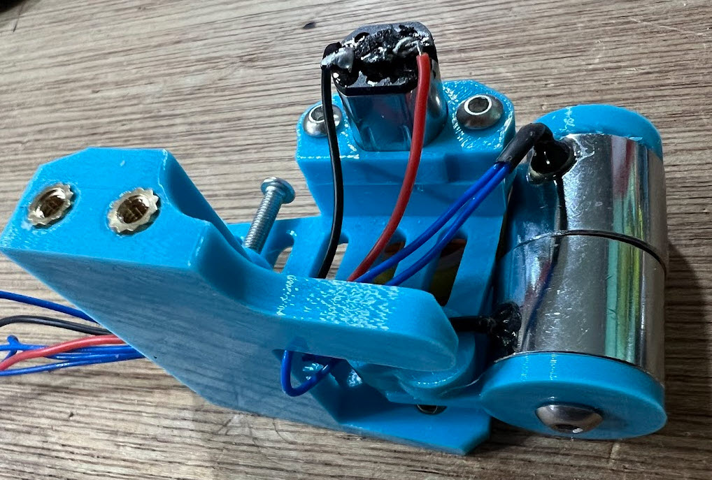

### Sensor Roller Assembly

The sensor roller is use to detect filament movement. The filament routes through it between three bearings, the bearings cause a small amount of friction on the filament - thus making the sensor move.

- This image shows the three components of the roller, in order of stacking with the bearings in position.
- Assemble as shown and screw together with three m3 screws.

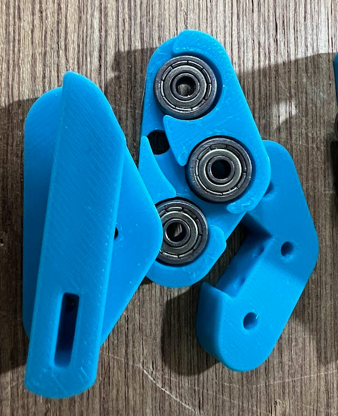

- Place a ball-bearing in to the hole where the microswitch will fit.
- Screw in the microswitch with 2.5 self tapping screws.
- Place the roller into the bufferrail as shown.

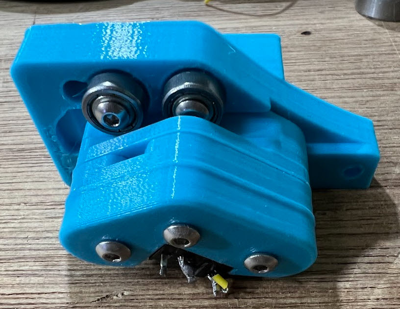

- Rotate the bufferrail, so you can see the open 'T' where the opto-endstop will fit. Align the sensorRoller so you can see the slot for the OpticalSensorKey. 
- Insert the OpticalSensorKey. I would suggest printing this in black to aid the opto-endstop working.

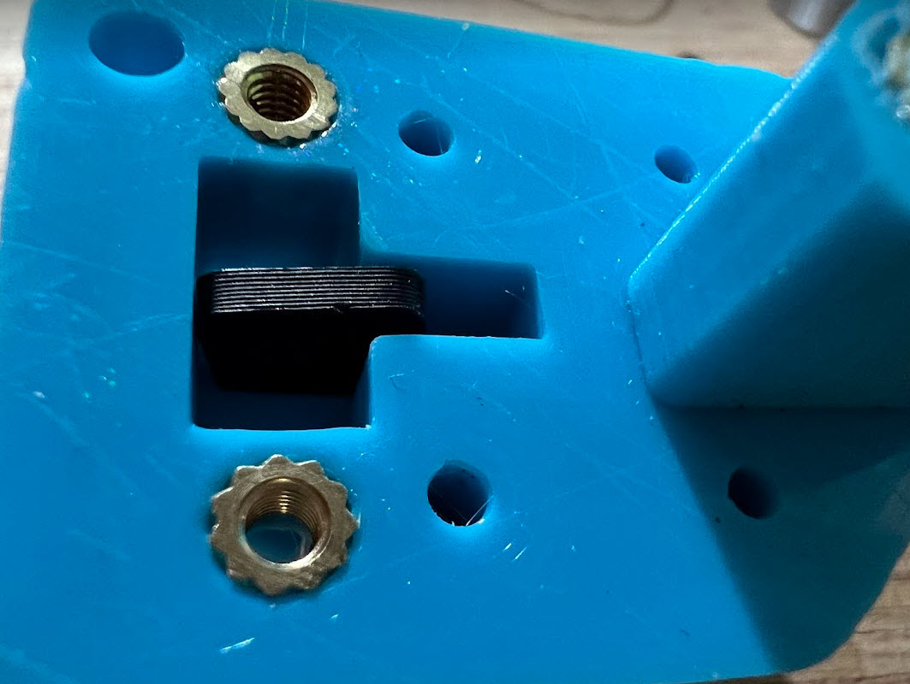

- Attach the opto-endstop.

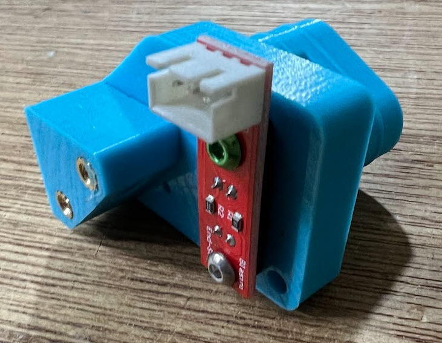

- Route the centre wire from the endstop as shown, and connect to the microswitch.

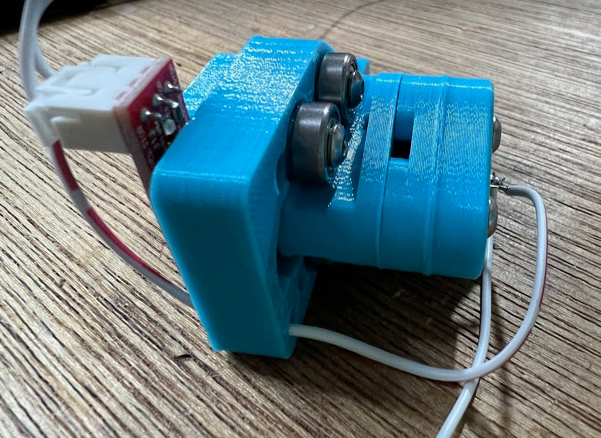

- Attach the motor assembly to the bufferrail.
- Attach this assembly to the rear plate.
- Attach the +ve and -ve from the opto-endstop to the +/- on the main 5V power blocks. (RED ARROW)
- Attach the other end of the microswitch to the existing lead connected to the mosfet-switch trigger. (GREEN ARROW)
    - In this image, I've connected this using an additional connector-block.

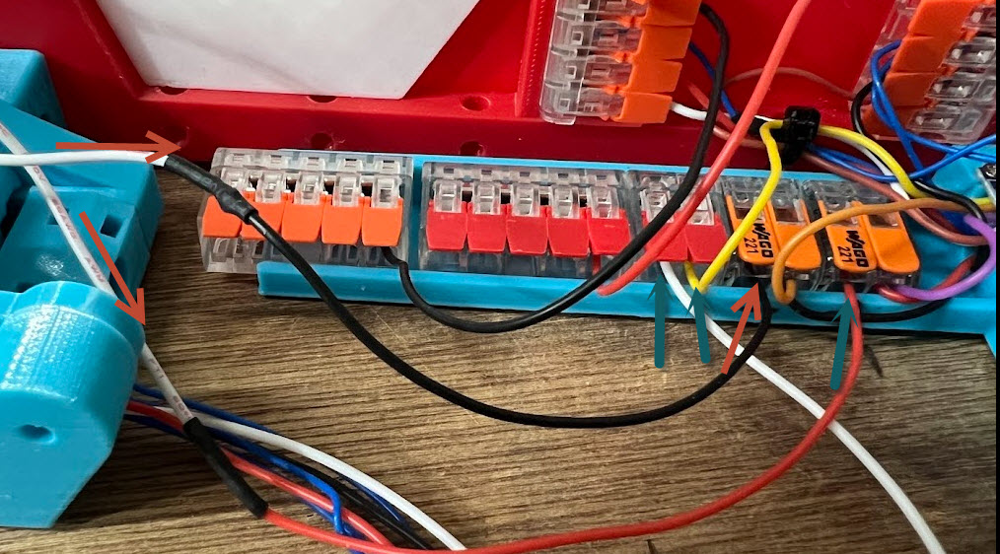

### Wiring the rear

- Only the motor and two solenoids remain to be wired. Like the front motor/solenoids these need connecting to the +/-ve of the two 5-Blocks. To get more connection points we will add two more 5-blocks, and connect them with short wires to the original 5-blocks.

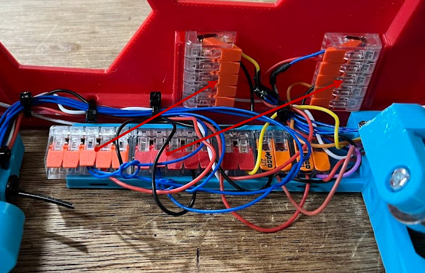

- As done for the front motor we need to work out the +ve / -ve using a 5V supply.
- Plug the motor into the new 5-block +/-ve.
- As done for the front solenoids we need to match up the correct wires (try one way and then the other).
- Plug the solenoids into the new 5-block +/-ve.

### Testing

- Place a small length of filament through the sensor roller, pulling / pushing this filament should start the motors.
- Use a 5V supply connected to the main 5v power input (yet to be attached to the plug socket) to test the solenoids and the motors turn.
- If the motors turn in the wrong direction (as in the video) then you can easily swap the +/-ve connectors.

<video width="320" height="240" controls>
  <source src="videos/wt.mov" type="video/mp4">
</video>

[You Tube Copy](https://youtu.be/CsUi9PYC_X0)

### Collet

- Push the 6mm collet into the bufferbase-mount.

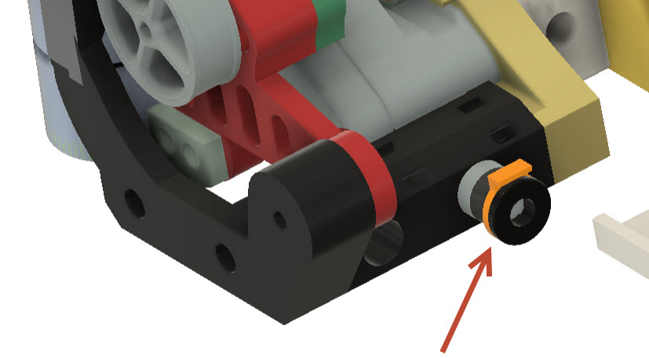

### Final assembly

#### Plug connection

- Insert the plug-socket into the main body
- Connect this to the main 5v input wires.

#### Rollers

- Attach the two rollers, with the shaft and tpu-rollerpipes with 2.5mm spacers on either side.

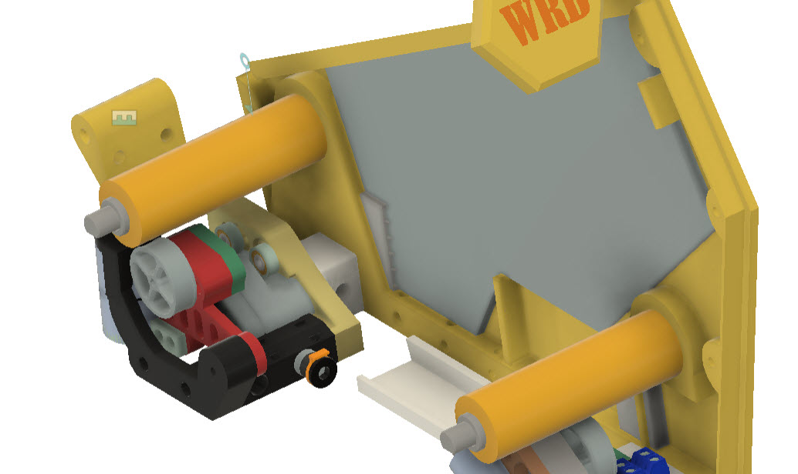 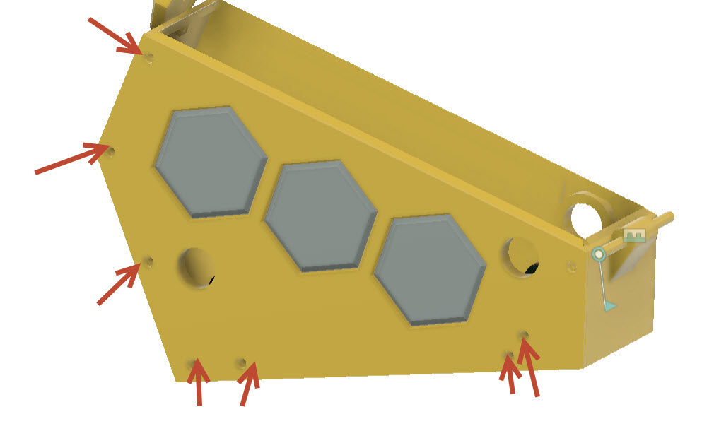 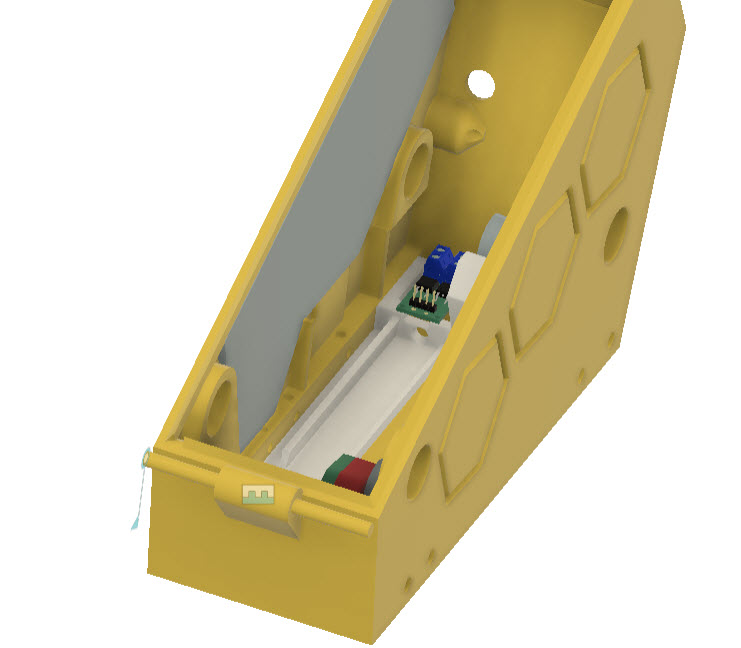 

#### Hinge mechanism

- The centre hinge will need two heat inserts before attaching as shown

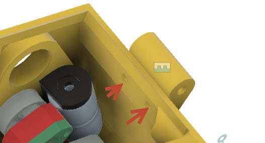 

#### PTFE

- Thread a length of PTFE (length ill depend on your needs) as shown.

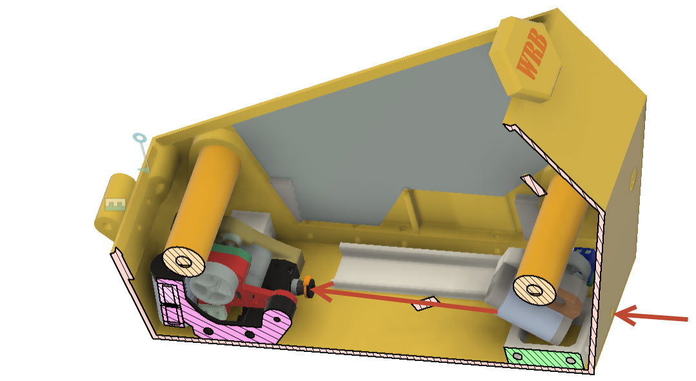 

### Top

- The top can be attached at the hinge with two screws, and two screws for the knob mechanism.

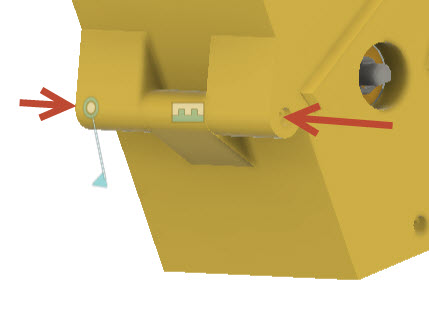 

### Knob

- The knob is attached with one screw through the hole in the top.
- A second screw in the base protrudes and allows the knob to lock the box.
